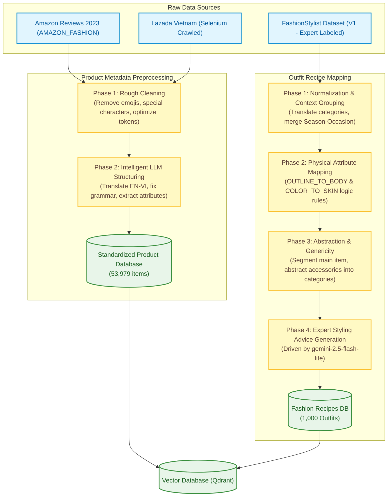
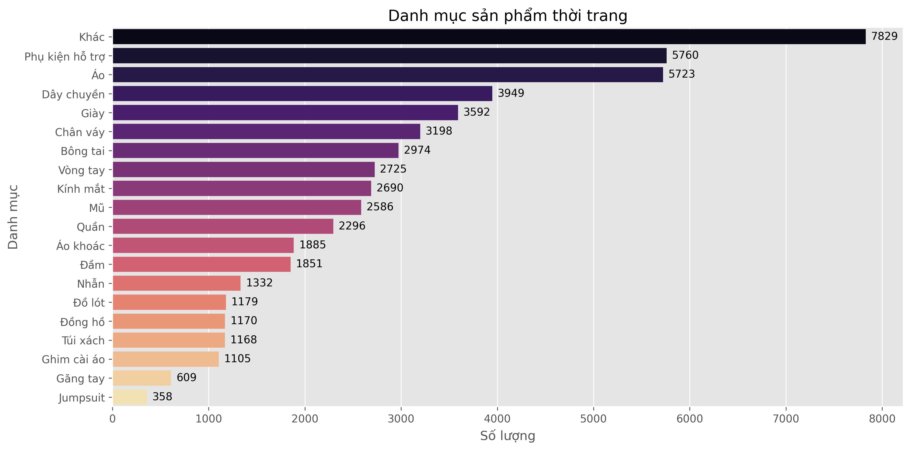
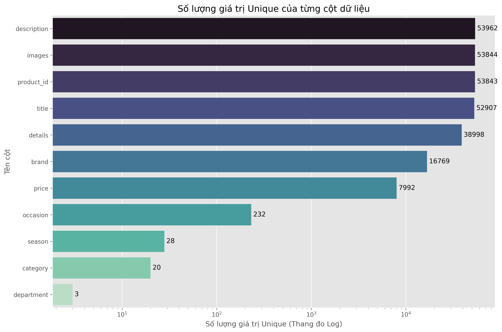

# Building a Fashion Consultation Chatbot using Retrieval-Augmented Generation and Large Language Models.
---

## 📌 Project Overview
This repository hosts the **Data Engineering** pipeline of our project – from raw ingestion, automated crawling, cleaning, and normalization, to expert fashion knowledge mapping. This pipeline establishes a highly structured, semantically rich **Knowledge Base** that acts as the core of our RAG-based chatbot. It ensures highly accurate retrievals, eliminates LLM hallucinations, and enables **ultra-personalized** styling recommendations based on:
* **Body Silhouette (Vóc dáng):** Pear shape (Dáng quả lê), Apple shape (Dáng quả táo), Hourglass (Dáng đồng hồ cát), Rectangle (Dáng hình chữ nhật), Plus-size (Người ngoại cỡ), Lean/Masc (Người mảnh khảnh), etc.
* **Skin Tone (Tông da):** Fair (Da sáng), Medium (Da trung bình), Tan (Da ngăm).
* **Context (Bối cảnh):** Seasonal categories (Spring/Summer/Autumn/Winter) merged with specific activities (School, Office, Sports, Travel, Party, Daily, etc.).

---

## ⚙️ Data Pipeline Architecture

The flowchart below demonstrates the end-to-end data pipeline, converting heterogeneous raw datasets into structured vector databases ready for real-time RAG:



---

## 📂 1. Raw Data Ingestion & Sources

Our knowledge base is compiled by aggregating three diverse data streams to ensure maximum domain coverage:

### 1.1. Amazon Reviews 2023 (McAuley-Lab)
* **Overview:** The `AMAZON_FASHION` subset of the massive Amazon product review dataset (1996 - 2023).
* **Data Source:** [McAuley-Lab/Amazon-Reviews-2023 (Hugging Face)](https://huggingface.co/datasets/McAuley-Lab/Amazon-Reviews-2023)
* **Characteristics:** Contains detailed English specifications, high-res image listings, and product features, but is highly noisy and lacks Vietnamese localization.
* **Raw Schema:**
  * `product_id`: Unique alphanumeric ASIN.
  * `title`: English product title.
  * `price`: Raw selling price (USD).
  * `store`: Brand name.
  * `images`: URLs of high-res images.
  * `details`: Key-value pairs of technical specifications.
  * `features`: Bulleted product highlights.
  * `description`: Elaborate textual descriptions.

### 1.2. Lazada Vietnam Scraper
* **Overview:** Custom web scraping pipeline targeting Lazada Vietnam to inject domestic brands, local pricing, and local fashion trends.
* **Ingestion Stages (3-Phase Pipeline):**
  1. **Phase 1 - URL Ingestion:** Utilizes **Selenium** driving Microsoft Edge to access target listings. Executes automated smooth scrolling (lazy loading bypass) to reveal all 40 products per page, scrapes product URLs using CSS Selectors, standardizes them, and appends them to a CSV stack.
  2. **Phase 2 - Headless Ingestion:** Runs browser processes in optimized headless mode, blocking non-essential assets (fonts/images) to maximize throughput. Injects active session Cookies (`cookies.json`) to bypass bot firewalls and enforce the Vietnamese language. Scrapes structured variables into `.jsonl`. Captcha bypass checkpoints are implemented: if a captcha triggers, the process pauses, switches to `headless=False`, prompts manual resolution, and restarts the session every 200 items to avoid VRAM leaks.
  3. **Phase 3 - Multi-Threaded Assets Downloader:** Downloads and processes images concurrently using **PIL** and `ThreadPoolExecutor`. The hero image is standardized as `MAIN` and variants are numbered sequentially (`PT01`, `PT02`, ...). Images are downscaled, padded with white space to fit a standardized **500x500 square**, and compressed. Products with broken images are discarded to enforce absolute data integrity.
* **Raw Lazada Schema:**
  * `product_id`, `product_url`, `title`, `price`, `department`, `category`, `colors`, `sizes`, `specifications` (brand, fabric, print, fit style, collar type, etc.), `highlights`, `description`, `images`.

### 1.3. FashionStylist Dataset (Expert Labeled)
* **Overview:** A high-fidelity, expert-annotated multimodal fashion dataset (V1 released on April 8, 2026) evaluating coordination compatibility at both individual item and full-outfit levels.
* **Data Source:** [recsys-benchmark/FashionStylist (GitHub)](https://github.com/recsys-benchmark/FashionStylist/blob/main/Dataset/Male/label_en.csv)
* **Scale:** **1,000 complete outfits** curated from **4,637 discrete items**, partitioned into:
  * **Female:** 500 outfits, 2,406 items.
  * **Male:** 300 outfits, 1.390 items.
  * **Kids:** 200 outfits, 841 items.
* **Target Objectives:** Serves as the training/evaluation foundation for 3 core tasks:
  1. *Item-Outfit Context Matching:* Recognizing and matching discrete layered garments within a complex multi-layered set.
  2. *Outfit Completion (Fill-in-the-Blank):* Proposing highly compatible items based on semantic styling context (style, material, vibe).
  3. *Outfit Aesthetic Evaluation:* Conducting expert-level grading of a set's visual harmony, color matching, and contextual appropriateness.

---

## 🧹 2. Product Preprocessing Pipeline


To synthesize the raw streams of Amazon and Lazada datasets, we execute a dual-stage cleaning pipeline:

### Phase 1: Rough Cleaning
* Eliminates emojis, escape symbols, duplicate tags, and corrupt characters.
* **Impact:** Minimizes token bloat to optimize cost and latency for subsequent LLM tasks.

### Phase 2: Intelligent LLM Structuring
Drives the cleaned data through an LLM to build a unified Vietnamese schema:
1. **Attribute Extraction:** Distills verbose description blocks into clean, structured key-value maps.
2. **Translation & Correction:** Localizes English values (Amazon) to natural Vietnamese and resolves Vietnamese grammar/typo anomalies (Lazada).
3. **Context Injection:** Evaluates product metadata to auto-tag appropriate `season` and `occasion` variables.
4. **Unified Output Schema:** Synthesizes **53,979 clean fashion products** structured as follows:

| Field | Type | Description |
| :--- | :--- | :--- |
| `product_id` | String | Unique product identifier |
| `title` | String | Standardized, highly descriptive product title in Vietnamese |
| `category` | String | Broad product category |
| `department` | String | Target demographic |
| `price` | Numeric | Normalized numerical price in VND |
| `details` | Object | Physical properties map: `main_color` (dominant color), `material` (fabric type), `size` (available sizes), `pattern` (print/texture) |
| `season` | String | Harmonized season suitability |
| `occasion` | Array | Occasion suitability array |
| `brand` | String | Extracted brand name |
| `images` | Array | Array of local image paths and their variant positions |
| `description` | String | Concise, marketing-ready product description in Vietnamese |

---

## 🗺️ 3. Fashion Recipe Mapping (Outfit Matching)

To transform raw `FashionStylist` sets into scalable, intelligent **recipes** applicable across thousands of unique products in our inventory, we utilize a joint **Rule-based & LLM Ingestion** engine:

```
[FashionStylist Raw Outfit] 
        │
        ▼ (Phase 1)
[Translate categories to Vietnamese & Merge Season-Occasion into Context]
        │
        ▼ (Phase 2)
[Physical Attribute Mapping via Expert Rules]
 ├── Fabric/Cut Silhouette (Outline) ──► Target Body Shapes (dang_nguoi) [OUTLINE_TO_BODY]
 └── Colors/Patterns                 ──► Target Skin Tones (tone_da)     [COLOR_TO_SKIN]
        │
        ▼ (Phase 3)
[Abstraction & Genericity Parsing]
 ├── Hero/Base Item (e.g., specific hoodie)  ──► Kept as core entity
 └── Coordinating Items (e.g., specific shoes)──► Abstracted to broad categories (e.g., "Giày dép")
        │
        ▼ (Phase 4)
[Expert LLM Stylist Synthesis]
 └── Inject context pack ──► Generate expert recommendation reasoning (ly_do_tu_van) via gemini-2.5-flash-lite
```

### Detailed Mapping Operations:
* **Phase 1 - Category & Context Normalization:** Translates foreign style taxologies into standardized Vietnamese terms (e.g., *outerwear* -> *Áo khoác nhẹ/Áo len*). Concatenates seasons and activities into a singular contextual variable: `boi_canh` (e.g., *"Mùa xuân – Học đường"*). Runs regular expressions to extract stylistic aesthetics (`phong_cach`).
* **Phase 2 - Physical Body & Skin Inferences:** Applies logical reasoning matrices to resolve compatibility:
  * `OUTLINE_TO_BODY` Rule: Maps garment fit patterns to body shapes. For example, a `"loose fit"` hoodie maps to *Pear (Dáng quả lê)*, *Apple (Dáng quả táo)*, or *Plus-size (Người ngoại cỡ)*; a `"skinny fit"` maps to *Hourglass (Dáng đồng hồ cát)* or *Lean (Người mảnh khảnh)*.
  * `COLOR_TO_SKIN` Rule: Maps colors to compatible skin undertones. For instance, neon tones map to *Fair (Da sáng)*; neutrals/pastels map to *All Tones (Mọi tone da)*; warm earths map to *Tan (Da ngăm)*.
* **Phase 3 - Abstraction & Formula Genericity:** Segments coordinates into **"Main Item"** and **"Accessories/Coordinating Items"**. We substitute the exact item IDs of accessories with general category tokens. 
  * *Why?* This provides the chatbot with structural recipes. Instead of recommending a single rigid outfit, the chatbot uses the recipe to search Qdrant dynamically and compose outfits using any matching items currently in stock.
* **Phase 4 - LLM Stylist Synthesis:** Formulates a semantic prompt merging the extracted main item, categories, target body shapes, skin tones, and context, passing it to **gemini-2.5-flash-lite**. The model plays the role of a professional fashion stylist and generates a smooth, persuasive styling rationale in Vietnamese (`ly_do_tu_van`).

---

## 📊 4. Data Samples (Before & After)

Below are actual, raw data structures versus processed outputs, showing how values are refined through our pipeline:

### 4.1. Amazon Product Ingestion

🏠 **Raw Ingestion Input (Amazon):**
```json
{
    "product_id": "B07SB2892S", 
    "title": "RONNOX Women's 3-Pairs Bright Colored Calf Compression Tube Sleeves", 
    "main_category": "AMAZON FASHION", 
    "price": 17.99, 
    "store": "RONNOX", 
    "images": [
        {"large": "images/B07SB2892S_MAIN.jpg", "variant": "MAIN"},
        {"large": "images/B07SB2892S_PT01.jpg", "variant": "PT01"}
    ], 
    "details": {
        "Is Discontinued By Manufacturer": "No", 
        "Package Dimensions": "7.7 x 4.3 x 1.8 inches; 6.38 Ounces", 
        "Department": "womens", 
        "Date First Available": "July 18, 2017", 
        "Manufacturer": "RONNOX"
    }, 
    "features": [
        "Pull On closure", 
        "Size Guide: \"S\" fits calf 10-12 inches. \"M\" fits calf 12-14 inches...",
        "3 Pairs: Styles and colors as seen in the picture. Choose between colorful sporty patterns & colored solids",
        "Medium Compression: The solid styles have 16-20 mmHg Graduated Compression...",
        "Compression improves blood flow, aids with circulation..."
    ], 
    "description": [
        "Ronnox Calf Sleeves - Allowing Your Body to Perform at Its Best!... ➤ Sizes: Small / Medium / Large / Extra Large. ➤ Colors: Hot Pink / Neon Green."
    ]
}
```

✨ **Standardized RAG Output (Vietnamese Localized):**
```json
{
    "product_id": "B07SB2892S",
    "title": "Bộ 3 đôi tất ống ép hỗ trợ bắp chân RONNOX nữ",
    "category": "Phụ kiện hỗ trợ",
    "department": "Nữ",
    "price": 431759,
    "details": {
        "main_color": "Hồng neon, Xanh neon",
        "material": "Neoprene",
        "size": "S, M, L, XL",
        "pattern": "Trơn, Họa tiết thể thao"
    },
    "season": "Quanh năm",
    "occasion": ["Thể thao", "Du lịch"],
    "brand": "RONNOX",
    "images": [
        {"large": "images/B07SB2892S_MAIN.jpg", "variant": "MAIN"},
        {"large": "images/B07SB2892S_PT01.jpg", "variant": "PT01"}
    ],
    "description": "Tất hỗ trợ bắp chân với công nghệ nén giúp cải thiện tuần hoàn máu và giảm mỏi cơ. Chất liệu vải mềm mại, thấm hút mồ hôi và co giãn tốt."
}
```

---

### 4.2. Lazada Product Ingestion

🏠 **Raw Ingestion Input (Lazada Scraped):**
```json
{
    "product_id": "pdp-i13360675870", 
    "product_url": "https://www.lazada.vn/products/pdp-i13360675870.html", 
    "title": "V·grass/V-GRASS | Chân Váy Dài Một Phân Bằng Lụa Organza Thêu Đính Chất Lượng Cao", 
    "price": 17655000, 
    "department": "Nữ", 
    "category": "Chân váy", 
    "colors": ["màu xám chim bồ câu"], 
    "sizes": ["L.", "s", "Ông."], 
    "specifications": {
        "Thương hiệu": "V·grass/V-GRASS", 
        "SKU": "13360675870_VNAMZ-116870185329", 
        "Chất liệu trang phục": "Sa tanh", 
        "Họa tiết": "In toàn bộ", 
        "Phong cách trang phục": "Bình thường", 
        "Loại đầm": "Váy chữ A"
    }, 
    "highlights": [], 
    "description": [
        "Thiết kế nửa chiều dài...",
        "Organza lụa nguyên chất...",
        "Đính cườm thủ công..."
    ], 
    "images": [
        {"large": "images/pdp-i13360675870_MAIN.jpg", "variant": "MAIN"},
        {"large": "images/pdp-i13360675870_PT01.jpg", "variant": "PT01"}
    ]
}
```

✨ **Standardized RAG Output (Vietnamese Localized):**
```json
{
    "product_id": "pdp-i13360675870", 
    "title": "Chân váy dài lụa Organza thêu đính", 
    "category": "Chân váy", 
    "department": "Nữ", 
    "price": 17655000, 
    "details": {
        "main_color": "Xám chim bồ câu", 
        "material": "Sa tanh, lụa Organza", 
        "size": "S, L", 
        "pattern": "In toàn bộ"
    }, 
    "season": "Mùa hạ", 
    "occasion": ["Xã hội", "Hàng ngày"], 
    "brand": "V·grass/V-GRASS", 
    "images": [
        {"large": "images/pdp-i13360675870_MAIN.jpg", "variant": "MAIN"}, 
        {"large": "images/pdp-i13360675870_PT01.jpg", "variant": "PT01"}, 
        {"large": "images/pdp-i13360675870_PT02.jpg", "variant": "PT02"}
    ], 
    "description": "Chân váy chữ A dài nửa thân được chế tác từ lụa organza cao cấp với chi tiết đính cườm thủ công tinh xảo. Thiết kế sang trọng, linh hoạt cho cả đi chơi và sự kiện trang trọng."
}
```

---

### 4.3. Processed Output Outfit Recipe (Fashion Recipes)

This dataset coordinates with our target catalog to yield abstract outfit blueprints enriched by expert LLM stylist reasoning:

```json
{
  "rule_key": "Áo khoác nhẹ/Áo len | minimalist casual hooded top",
  "phong_cach": "Japanese Cityboy",
  "boi_canh": "Mùa xuân – Học đường",
  "dang_nguoi": [
    "Dáng quả lê",
    "Dáng quả táo",
    "Người ngoại cỡ"
  ],
  "tone_da": [
    "Mọi tone da"
  ],
  "goi_y_phoi_cung": [
    "Áo mặc trong (áo thun/sơ mi)",
    "Quần/Chân váy",
    "Giày dép"
  ],
  "ly_do_tu_van": "Sự kết hợp giữa chiếc áo hoodie tối giản và các món đồ basic như áo thun/sơ mi, quần/chân váy cùng giày sneaker tạo nên vẻ ngoài năng động, khỏe khoắn đậm chất Japanese Cityboy, rất phù hợp với không khí học đường mùa xuân."
}
```

---

## 📈 5. Catalog & Dataset Statistics
Following our complete execution of the pipeline, the active knowledge base registers:
* **Total Standardized Product Records:** `53,979` items.
* **Total Expert Outfit Recipes:** `1,000` structured recipes.
* **Localization Profile:** 100% Vietnamese translation supporting common bilingual terminology (e.g., *oversized, blazer, mix & match*).

### Data Visualization
<p align="center">
  
  <br/><br/>
  
</p>

---
## 🤝 Contributors
### 👤 Châu Quốc Vinh
[](https://github.com/chauquocvinh2234)
[](mailto:vinhit220304@gmail.com)

### 👤 Vũ Trọng Nghĩa
[](https://github.com/TrongNghia041104)
[](mailto:nghia.hpotaku04@gmail.com)
