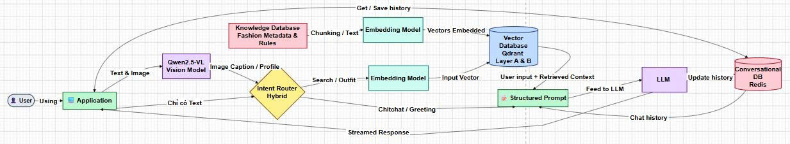
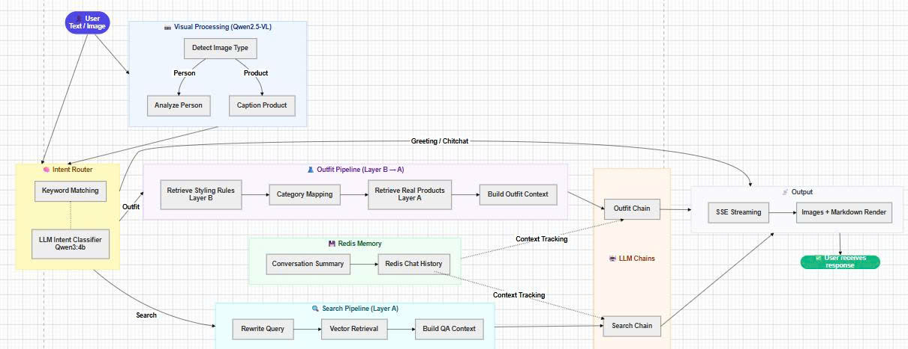
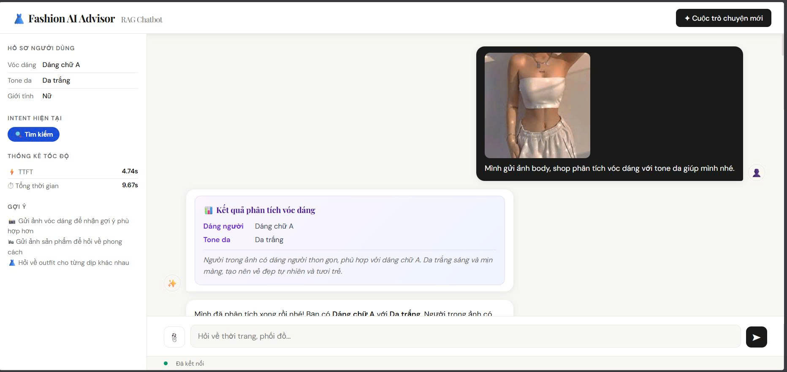
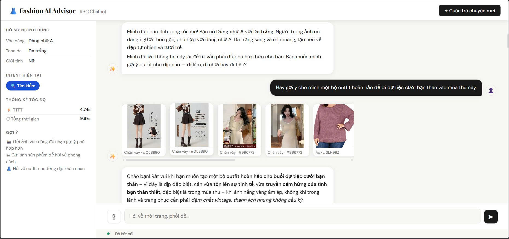
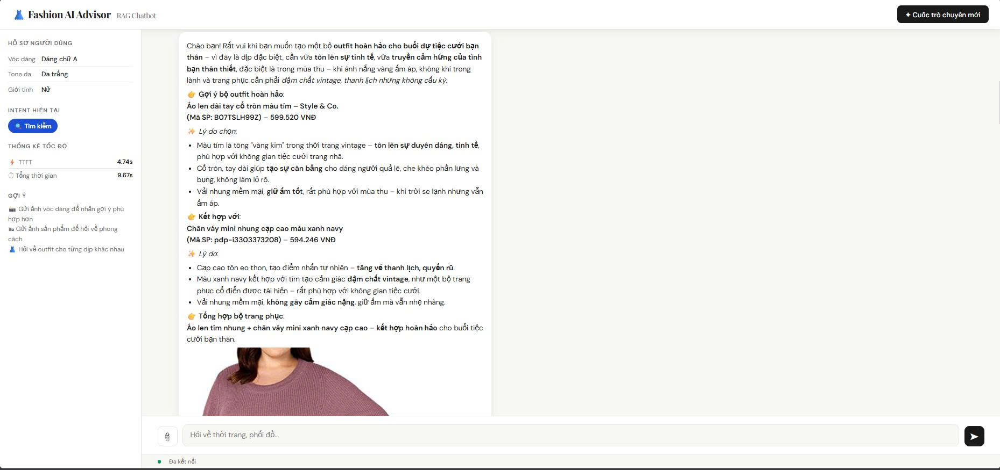
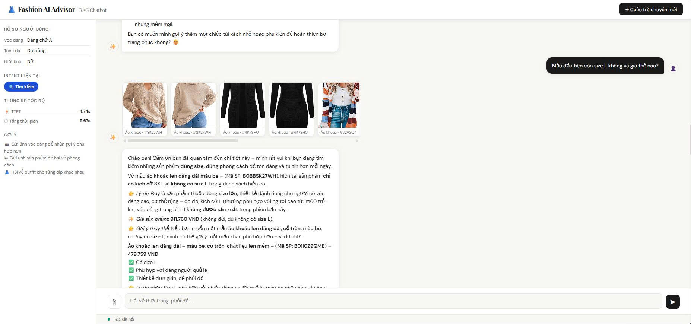

# Building a Fashion Consultation Chatbot using Retrieval-Augmented Generation and Large Language Models.
---

## 📌 Project Overview
This repository contains the complete codebase and technical design of **Fashion RAG Chatbot** — an intelligent, multimodal "Virtual Style Assistant". 

Our system integrates **Data Engineering pipelines** (raw ingestion, Selenium crawling, data cleaning, and expert styling advice mapping) with a **real-time Retrieval-Augmented Generation (RAG) system** driven by Local Language Models (LLMs) and Vision-Language Models (VLMs). The system runs entirely locally on consumer hardware or affordable GPU clouds, enabling high-performance, cost-effective, and secure customer consultation.

We solve the fundamental limitations of modern e-commerce chatbots (rigid rule-based answers) and native LLMs (hallucinations about product stock/pricing) by:
1. **Intelligent Profile Matching (PERSON):** Real-time physical analysis (Body Silhouette & Skin Tone) from user-uploaded images to offer hyper-personalized outfit coordinate suggestions.
2. **Visual Product Search (PRODUCT):** Multimodal intent classification, allowing customers to upload items of clothing, automatically describe them, and retrieve corresponding items in the inventory.
3. **Hard-Constrained Retrieval:** Combining semantic HNSW vector searches in **Qdrant** with **Payload Filtering** to ensure the chatbot only recommends products that are actually in stock, match the correct gender, sizes, and price points.
4. **Context-Aware Dialogue Memory:** Running **Redis Stack** as an ultra-fast in-memory conversational cache with auto-summarization and custom TTL management.

---

## ⚙️ Core Architecture & Data Flows

The diagrams below illustrate the end-to-end system architecture and the data processing flows of our fashion chatbot:

<p align="center">
  
  <br/><br/>
  
</p>

---

## 📂 1. Raw Data Ingestion & Sources

Our knowledge base aggregates three distinct data streams to ensure maximum domain coverage and localization:

### 1.1. Amazon Reviews 2023 (McAuley-Lab)
* **Data Source:** [McAuley-Lab/Amazon-Reviews-2023 (Hugging Face)](https://huggingface.co/datasets/McAuley-Lab/Amazon-Reviews-2023)
* **Characteristics:** The `AMAZON_FASHION` subset provides robust product feature lists and high-quality specifications, but is highly noisy and lacks Vietnamese localization.
* **Raw Schema:** `product_id` (ASIN), `title`, `price` (USD), `store` (Brand), `images` (URLs), `details` (Technical properties), `features` (Highlights), `description`.

### 1.2. Lazada Vietnam Scraper (Custom Selenium Tool)
* **Characteristics:** A custom scraping pipeline built to harvest domestic brands, Vietnamese pricing models, and local fashion trends.
* **Ingestion Stages:**
  1. **Phase 1 - URL Ingestion:** Utilizes Selenium driving Microsoft Edge. Automates lazy scrolling (smooth-scrolling scripts) to reveal all 40 products per page, extracts product URLs via CSS selectors, and saves them to a CSV.
  2. **Phase 2 - Headless Metadata Crawler:** Runs in headless mode (blocking fonts/images to save bandwidth) using stored active session Cookies (`cookies.json`) to bypass bot detection. Reads URLs from CSV and extracts title, price, colors, sizes, specifications, highlights, and images into `.jsonl`. Includes a captcha fallback trigger: if a slider captcha occurs, the browser shifts to `headless=False` for manual completion.
  3. **Phase 3 - Multi-Threaded Image Processor:** Downloads product hero images and variants concurrently using `ThreadPoolExecutor` and PIL. Images are cropped, padded onto a standardized **500x500 square white background**, compressed, and stored locally. Products with invalid images are pruned to ensure absolute visual data integrity.

### 1.3. FashionStylist Dataset (Expert Labeled)
* **Data Source:** [recsys-benchmark/FashionStylist (GitHub)](https://github.com/recsys-benchmark/FashionStylist)
* **Scale:** **1,000 outfits** made up of **4,637 discrete items** (500 Female, 300 Male, 200 Kids) coupled with expert occasion annotations (Office, Sports, Casual, Travel, School, etc.).
* **Objectives:** Serves as the foundation for Context Matching, Outfit Completion, and Outfit Aesthetic Evaluation.

---

## 🧹 2. Product Preprocessing & Intelligent LLM Structuring

To standardize raw heterogeneous inputs from Amazon and Lazada into a single, high-fidelity RAG-ready catalog, we implement a two-stage preprocessing pipeline:


* **Phase 1 - Rough Cleaning:** Eliminates emoji symbols, duplicate markup, escape sequences, and corrupted encodings. This reduces token overhead by **up to 40%**, optimizing runtime performance and minimizing API/LLM costs.
* **Phase 2 - Intelligent LLM Structuring:** Utilizes an LLM to parse raw descriptions into structured Vietnamese fields, translate attributes from English to Vietnamese, resolve spelling/typographical errors, and inject seasonal/contextual classification tags.

### Standardized Database Schema (53,979 items)

| Field | Type | Description |
| :--- | :--- | :--- |
| `product_id` | String | Unique product identifier |
| `title` | String | Standardized, highly descriptive product title in Vietnamese |
| `category` | String | Standardized broad category |
| `department` | String | Target demographic |
| `price` | Numeric | Normalized price in VND |
| `details` | Object | Physical properties map: `main_color` (dominant color), `material` (fabric type), `size` (available sizes), `pattern` (print/texture) |
| `season` | String | Seasonal suitability |
| `occasion` | Array | Occasion suitability array |
| `brand` | String | Extracted and normalized brand name |
| `images` | Array | Localized image paths |
| `description` | String | Concise, marketing-ready product description in Vietnamese |

---

## 🗺️ 3. Fashion Recipe & Expert Styling Advice Mapping

To translate the raw item coordinates in the `FashionStylist` dataset into abstract, scalable styling rules, we use a hybrid **Rule-based & LLM-guided Ingestion Engine**:

```
[FashionStylist Raw Outfit] 
        │
        ▼ (Phase 1: Normalization)
[Translate categories to Vietnamese & Merge Season-Occasion into Context]
        │
        ▼ (Phase 2: Physical Attribute Inference)
 ├── Fabric/Cut Silhouette (Outline) ──► Target Body Shapes (dang_nguoi) [OUTLINE_TO_BODY]
 └── Colors/Patterns                 ──► Target Skin Tones (tone_da)     [COLOR_TO_SKIN]
        │
        ▼ (Phase 3: Formula Abstraction)
 ├── Hero/Base Item (e.g., specific hoodie)  ──► Kept as core entity
 └── Coordinating Items (e.g., specific shoes)──► Abstracted to broad categories (e.g., "Giày dép")
        │
        ▼ (Phase 4: Expert Stylist Synthesis)
 └── Ingest context pack ──► Generate expert recommendation reasoning (ly_do_tu_van) via gemini-2.5-flash-lite
```

### Ingestion Logic:
1. **Rule mapping (`OUTLINE_TO_BODY`):** Matches outfit fits to body shapes. (e.g., *loose fit* hoodies map to *Pear*, *Apple*, or *Plus-size*; *skinny/slim fit* jeans map to *Hourglass* or *Lean*).
2. **Rule mapping (`COLOR_TO_SKIN`):** Matches dominant garment colors to skin undertones. (e.g., *warm earth tones* map to *Tan*; *neutrals/pastels* map to *All Tones*; *bright/neon* maps to *Fair*).
3. **Coordinating Item Abstraction:** Instead of storing rigid 1-to-1 outfits, the recipe abstracts coordinates (e.g., a specific sneaker is replaced with `"Giày dép"`). This creates an **elastic styling blueprint**. When a customer queries, the chatbot fetches the blueprint and dynamically queries the real-time Qdrant inventory for in-stock, correct-sized matching items!
4. **Stylist Synthesis:** Prompts **gemini-2.5-flash-lite** with the structured attributes to write a natural, professional styling rationale (`ly_do_tu_van`) in Vietnamese explaining the outfit's visual harmony.

---

## 📊 4. Dataset Statistics & Data Samples (Thống Kê & Mẫu Dữ Liệu)

### 4.1. Catalog & Dataset Statistics
Following our complete execution of the pipeline, the active knowledge base registers:
* **Total Standardized Product Records:** `53,979` items.
* **Total Expert Outfit Recipes:** `1,000` structured recipes.
* **Localization Profile:** 100% Vietnamese translation supporting common bilingual terminology (e.g., *oversized, blazer, mix & match*).

### Data Visualization
<p align="center">
  
  <br/><br/>
  
</p>

---

### 4.2. Data Samples (Before & After Preprocessing)

Below are the actual raw metadata inputs compared to our structured, RAG-ready pipeline outputs, demonstrating how the raw datasets are refined and translated:

#### 4.2.1. Amazon Product Ingestion Example

🏠 **Raw Amazon Ingestion Input:**
```json
{
    "product_id": "B07SB2892S", 
    "title": "RONNOX Women's 3-Pairs Bright Colored Calf Compression Tube Sleeves", 
    "main_category": "AMAZON FASHION", 
    "price": 17.99, 
    "store": "RONNOX", 
    "images": [
        {"large": "images/B07SB2892S_MAIN.jpg", "variant": "MAIN"}, 
        {"large": "images/B07SB2892S_PT01.jpg", "variant": "PT01"}
    ], 
    "details": {
        "Is Discontinued By Manufacturer": "No", 
        "Package Dimensions": "7.7 x 4.3 x 1.8 inches; 6.38 Ounces", 
        "Department": "womens", 
        "Date First Available": "July 18, 2017", 
        "Manufacturer": "RONNOX"
    }, 
    "features": [
        "Pull On closure", 
        "Size Guide: \"S\" fits calf 10-12 inches. \"M\" fits calf 12-14 inches...", 
        "3 Pairs: Styles and colors as seen in the picture. Choose between colorful sporty patterns & colored solids", 
        "Medium Compression: The solid styles have 16-20 mmHg Graduated Compression...", 
        "Helps in reducing swelling and aching in the legs. Great for pregnancy & flight travel"
    ], 
    "description": [
        "Ronnox Calf Sleeves - Allowing Your Body to Perform at Its Best!... ➤ Sizes: Small / Medium / Large / Extra Large. ➤ Colors: Hot Pink / Neon Green."
    ]
}
```

✨ **Standardized RAG Output (Vietnamese Localized):**
```json
{
    "product_id": "B07SB2892S",
    "title": "Bộ 3 đôi tất ống ép hỗ trợ bắp chân RONNOX nữ",
    "category": "Phụ kiện hỗ trợ",
    "department": "Nữ",
    "price": 431759,
    "details": {
        "main_color": "Hồng neon, Xanh neon",
        "material": "Neoprene",
        "size": "S, M, L, XL",
        "pattern": "Trơn, Họa tiết thể thao"
    },
    "season": "Quanh năm",
    "occasion": ["Thể thao", "Du lịch"],
    "brand": "RONNOX",
    "images": [
        {"large": "images/B07SB2892S_MAIN.jpg", "variant": "MAIN"},
        {"large": "images/B07SB2892S_PT01.jpg", "variant": "PT01"}
    ],
    "description": "Tất hỗ trợ bắp chân với công nghệ nén giúp cải thiện tuần hoàn máu và giảm mỏi cơ. Chất liệu vải mềm mại, thấm hút mồ hôi và co giãn tốt."
}
```

#### 4.2.2. Lazada Product Ingestion Example

🏠 **Raw Lazada Scraped Input:**
```json
{
    "product_id": "pdp-i13360675870", 
    "product_url": "https://www.lazada.vn/products/pdp-i13360675870.html", 
    "title": "V·grass/V-GRASS | Chân Váy Dài Một Phân Bằng Lụa Organza Thêu Đính Chất Lượng Cao", 
    "price": 17655000, 
    "department": "Nữ", 
    "category": "Chân váy", 
    "colors": ["màu xám chim bồ câu"], 
    "sizes": ["L.", "s", "Ông."], 
    "specifications": {
        "Thương hiệu": "V·grass/V-GRASS", 
        "SKU": "13360675870_VNAMZ-116870185329", 
        "Chất liệu trang phục": "Sa tanh", 
        "Họa tiết": "In toàn bộ", 
        "Phong cách trang phục": "Bình thường", 
        "Loại đầm": "Váy chữ A"
    }, 
    "highlights": [], 
    "description": [
        "Thiết kế nửa chiều dài... Organza lụa nguyên chất... Đính cườm thủ công..."
    ], 
    "images": [
        {"large": "images/pdp-i13360675870_MAIN.jpg", "variant": "MAIN"}, 
        {"large": "images/pdp-i13360675870_PT01.jpg", "variant": "PT01"}
    ]
}
```

✨ **Standardized RAG Output (Vietnamese Localized):**
```json
{
    "product_id": "pdp-i13360675870", 
    "title": "Chân váy dài lụa Organza thêu đính", 
    "category": "Chân váy", 
    "department": "Nữ", 
    "price": 17655000, 
    "details": {
        "main_color": "Xám chim bồ câu", 
        "material": "Sa tanh, lụa Organza", 
        "size": "S, L", 
        "pattern": "In toàn bộ"
    }, 
    "season": "Mùa hạ", 
    "occasion": ["Xã hội", "Hàng ngày"], 
    "brand": "V·grass/V-GRASS", 
    "images": [
        {"large": "images/pdp-i13360675870_MAIN.jpg", "variant": "MAIN"}, 
        {"large": "images/pdp-i13360675870_PT01.jpg", "variant": "PT01"}
    ], 
    "description": "Chân váy chữ A dài nửa thân được chế tác từ lụa organza cao cấp với chi tiết đính cườm thủ công tinh xảo. Thiết kế sang trọng, linh hoạt cho cả đi chơi và sự kiện trang trọng."
}
```

#### 4.2.3. Processed Outfit Recipe Example (Fashion Recipes)

This blueprint represents how coordinates are abstracted into categorical labels while embedding expert stylist reasoning:
```json
{
  "rule_key": "Áo khoác nhẹ/Áo len | minimalist casual hooded top",
  "phong_cach": "Japanese Cityboy",
  "boi_canh": "Mùa xuân – Học đường",
  "dang_nguoi": [
    "Dáng quả lê",
    "Dáng quả táo",
    "Người ngoại cỡ"
  ],
  "tone_da": [
    "Mọi tone da"
  ],
  "goi_y_phoi_cung": [
    "Áo mặc trong (áo thun/sơ mi)",
    "Quần/Chân váy",
    "Giày dép"
  ],
  "ly_do_tu_van": "Sự kết hợp giữa chiếc áo hoodie tối giản và các món đồ basic như áo thun/sơ mi, quần/chân váy cùng giày sneaker tạo nên vẻ ngoài năng động, khỏe khoắn đậm chất Japanese Cityboy, rất phù hợp với không khí học đường mùa xuân."
}
```

---

## 💾 5. Chatbot System Technical Components

```
Chatbot_Fashion/
├── main.py                        # Server Entry Point
├── docker-compose.yml             # Qdrant + Redis Stack Orchestration
├── app/
│   ├── api.py                     # FastAPI server + SSE Streaming Response
│   ├── config.py                  # Core variables, URL routing, model definitions
│   └── core/                      # Modular backend components
│       ├── embeddings.py          # Vector embedding interface
│       ├── vector_store.py        # Qdrant DB driver & HNSW retrieval
│       ├── llm.py                 # LLM wrapper & Prompt templates
│       ├── vision.py              # VLM preprocessing & feature extraction
│       ├── intent.py              # Text classification logic
│       ├── outfit.py              # Layer B rules parser & recipe builders
│       ├── history.py             # Redis history database & summarizer
│       └── chains.py              # LangChain integration
```

### 5.1. Conversational Memory: Redis Stack
* **Why Redis?** To maintain fluid, human-like dialogue, the chatbot needs to refer to preceding turns. Redis stores conversation logs in-memory for microsecond-level retrieval.
* **Architecture:** hội thoại (conversational turns) are stored as JSON structures using Redis **Lists**.
* **Memory Management:** To ensure high performance, sessions are assigned a **Time-To-Live (TTL)** (e.g., deleted after 12 or 24 hours of inactivity).
* **Auto-Summarization:** If the context length exceeds 8 messages, the backend uses the LLM to summarize past turns, retaining the most recent 4 messages in full text. This keeps the prompt context compact, preventing VRAM overflow.

### 5.2. Vector Database: Qdrant
* **Why Qdrant?** Serves as the "long-term memory" of the system, hosting all product embeddings. Rust-engineered, Qdrant is optimized for extreme throughput.
* **Similarity Search:** Employs **HNSW (Hierarchical Navigable Small World)** indexes to perform semantic similarity matches, handling complex colloquial text (e.g., *"phối đồ phong cách trẻ trung đi chơi"*).
* **Payload Filtering (Crucial for Business):** E-commerce systems cannot rely solely on semantic similarities; they must enforce strict filters (gender, size, price, availability). Qdrant allows storing attributes as a JSON payload attached directly to each vector. During HNSW search, Qdrant applies hard filtering constraints *concurrently* rather than post-search. This guarantees that recommended items are physically in-stock, within budget, and match the target customer demographic, eliminating hallucinated out-of-stock products.

### 5.3. Dual-Language & Multilingual Embedding Models
Vietnamese fashion terminology is deeply blended with English loanwords (e.g., *"blazer oversized"*, *"streetwear năng động"*, *"mix & match"*). We evaluated four embedding models to solve this linguistic crossover:
1. **`BAAI/bge-m3`**: Multilingual, supports over 100 languages. 0.6B parameters, 1024 vector dimensions, 8192 context window. **Top performer in Vietnamese-English fashion semantics.**
2. **`intfloat/multilingual-e5-base`**: Multilingual. 0.3B parameters, 768 dimensions, 512 context.
3. **`VoVanPhuc/sup-SimCSE-Vietnamese-phobert-base`**: Vietnamese specialized. 0.1B parameters, 768 dimensions, 256 context.
4. **`bkai-foundation-models/vietnamese-bi-encoder`**: Vietnamese specialized. 0.1B parameters, 768 dimensions, 256 context.

### 5.4. Local LLM Generator: Qwen3-4B-Instruct
* **Alibaba's Qwen3-4B-Instruct** is an optimized Small Language Model (SLM) configured via Ollama. 
* It features a **262K context window**, providing exceptional reasoning and instruction-following capability. 
* Running locally, it allows business owners to keep their data fully private without paying recurring API fees.

### 5.5. Local VLM Processor: Qwen2.5-VL-3B-Instruct / Qwen3-VL-4B-Instruct
* Integrates vision capabilities. It uses a dynamic resolution vision-language architecture.
* Automatically analyzes user-uploaded images and extracts physical parameters (skin undertone, body proportions) or detects product characteristics (colors, sleeve style, fabric) with small footprint requirements.

---

## 🔄 6. Real-Time Multimodal Processing Pipeline

When a user interacts with the system, their input goes through a **5-Stage Execution Pipeline**:

```
[User Input: text and/or image]
       │
       ▼ (Stage 1: Multimodal Preprocessing)
[Resize image to <= 512px. Downscale with PIL to prevent GGML GPU crash]
       │
       ▼ (Stage 2: VLM Intent & Feature Extraction)
[VLM detect_image_type()] 
 ├── PRODUCT ──► Extract visual traits (color, form) ──► Convert to search query text
 └── PERSON  ──► Extract physical traits (body, skin) ──► Store into Redis profile session
       │
       ▼ (Stage 3: Query Embedding)
[Encode query text into vector using BGE-M3 (1024 dims)]
       │
       ▼ (Stage 4: Vector Retrieval & Constraint Filtering)
[Qdrant HNSW vector search + Payload filter constraints (gender, size, price, stock)]
       │
       ▼ (Stage 5: Anti-Hallucination LLM Response Generation)
[LLM synthesizes Top-K product context + history. Enforces strict factual grounding]
       │
       ▼
[Response streamed to client via FastAPI SSE Server-Sent Events]
```

---

## 📈 7. Experimental Evaluation & Performance Metrics

Testing and performance evaluations were conducted on a local hardware node equipped with:
* **GPU:** NVIDIA GeForce RTX 3060 (12GB VRAM)
* **CPU:** 12th Gen Intel Core i5-12400F
* **RAM:** 32GB DDR4
* **Runtime:** Ollama Server running local LLM/VLM models.

To evaluate retrieval quality and system latency, we generated a standard RAG test dataset consisting of **100 annotated queries** and assessed the pipeline using the **RAGAS framework** across multiple embedding layers.

### RAGAS & Latency Performance Table

| Embedding Model | Faithfulness | Answer Relevancy | Context Precision | Context Recall | TTFT (Time-to-First-Token) | Total Response Time |
| :--- | :---: | :---: | :---: | :---: | :---: | :---: |
| **`BAAI/bge-m3`** | **0.4666** | **0.7462** | **0.6056** | **0.6321** | 4.50 seconds | 7.50 seconds |
| **`multilingual-e5-base`** | 0.3832 | 0.7393 | **0.6166** | **0.6333** | 3.00 seconds | 6.00 seconds |
| **`sup-SimCSE-VietNamese-phobert-base`** | 0.4367 | 0.6342 | 0.2213 | 0.2143 | **1.90 seconds** | **4.20 seconds** |
| **`vietnamese-bi-encoder`** | 0.4198 | 0.7337 | 0.3290 | 0.4150 | **1.88 seconds** | **4.15 seconds** |

### Metrics Definition & Insights:
* **Faithfulness (Độ trung thực):** Evaluates if the LLM output is strictly derived from the retrieved documents. **BGE-M3** achieved the highest score (`0.4666`), validating its capability to feed clean, well-aligned contexts to the generator, thereby eradicating hallucinations.
* **Answer Relevancy (Độ liên quan câu trả lời):** Assesses if the generated response aligns with the user's intent. All models except PhoBERT hovered around `0.73+`, showing Qwen3's strong capability to synthesize responses.
* **Context Precision & Recall (Chỉ số truy xuất):** Measures how effectively the vector search pushes relevant products to the top and pulls all necessary context blocks. The multilingual models (**BGE-M3** and **E5**) performed exceptionally well, scoring **above 60%**, whereas monolingual Vietnamese models struggled because they failed to map English-based fashion tags and code-mixed words (e.g. *oversized*, *sneakers*).
* **Latency (TTFT & Total Time):** PhoBERT and Vietnamese Bi-Encoder models are lightweight (0.1B parameters, 256 token length limit), resulting in rapid responses (TTFT < 2s). However, they sacrificed context precision. **BGE-M3**, while having higher latency (TTFT of 4.5s), provides superior search precision, making it the recommended option for high-accuracy retail systems.

---

## 📸 8. Visual Interface Demo (Chatbot in Action)

Here is a visual showcase of the **Fashion RAG Chatbot** interface executing real-time consultations:

| 💬 1. Physical Profile Analysis (PERSON) | 👗 2. Catalog Matching & Image Display |
| :---: | :---: |
|  |  |
| *Chatbot automatically processes a user-uploaded image to analyze body shape and skin tone, saving these characteristics into the active conversation session.* | *Based on the profile, the chatbot queries Qdrant for suitable items, displaying real product images, exact pricing, and direct catalog metadata.* |

| 👔 3. Structured Outfit Suggestions | 🔍 4. Visual Product Search (PRODUCT) |
| :---: | :---: |
|  |  |
| *Provides a complete outfit recipe, mapping coordinating layers together with detailed styling explanations in Vietnamese.* | *A user uploads an image of an apparel item; the system classifies it as PRODUCT, captions its properties, and retrieves identical or similar products.* |

---

## 🚀 9. Quick Setup & Run Checklist

For detailed step-by-step setup guides, refer to [SETUP_GUIDE.md](file:///c:/Users/vinhp/OneDrive/M%C3%A1y%20t%C3%ADnh/Building_a_Fashion_Product_Consultation_Chatbot_using_RAG_LLM/Chatbot_Fashion/docs/SETUP_GUIDE.md). Below is the quick launch checklist:

### 1. Initialize Virtual Environment & Install Libraries
```bash
# Navigate to sub-project directory
cd Chatbot_Fashion

# Create virtual environment
python -m venv venv
venv\Scripts\activate

# Install required dependencies
pip install -r requirements.txt
```

### 2. Launch Local Services via Docker
Start the Qdrant (Vector database) and Redis Stack (conversational history cache) containers:
```bash
docker-compose up -d
```
* **Qdrant dashboard:** `http://localhost:6333/dashboard`
* **RedisInsight interface:** `http://localhost:8001`

### 3. Start LLM & VLM via Ollama
Ensure **Ollama** is running on your machine (or access it on a GPU node like Vast.ai via port-forwarding). Pull the models:
```bash
# Pull the vector embedding layer
ollama pull bge-m3

# Pull the core LLM text assistant
ollama pull qwen3:4b-instruct

# Pull the visual multimodal model
ollama pull qwen2.5vl:3b
```
If using a GPU cloud (e.g. Vast.ai), open the local SSH tunnel:
```bash
ssh -p <PORT> root@<IP_VASTAI> -L 11434:localhost:11434 -N
```

### 4. Index Products (Only required once)
Ensure your `.jsonl` files are placed inside `data/metadata/`. Open the notebook `notebooks/Chatbot_RAG_MultiModal.ipynb` and execute **Part 3: Data Pipeline** to calculate embeddings and index the products into Qdrant.

### 5. Launch Backend Web Server
```bash
python main.py
```
This boots the FastAPI backend on **`http://localhost:8000`**. You can open the chatbot interface directly in your browser!

---

## 🔮 10. Future Improvements
1. **FashionCLIP Integration:** Transition from VLM text-captioning to a unified Multimodal Embedding Space using models like FashionCLIP. This will allow direct image-to-image semantic vector search, dropping intermediate captioning latency and preserving fine-grained visual details.
2. **Stylist Fine-Tuning:** Supervised Fine-Tuning (SFT) of the local LLM on dedicated conversational fashion logs to align vocabulary and adopt the exact tone and phrasing of professional retail stylists.
3. **Product Catalog Scalability:** Expanding Qdrant payloads with real-time API syncs to sync with live inventory management databases.

---

## 🤝 Contributors

### 👤 Châu Quốc Vinh
[](https://github.com/chauquocvinh2234)
[](mailto:vinhit220304@gmail.com)

### 👤 Vũ Trọng Nghĩa
[](https://github.com/TrongNghia041104)
[](mailto:nghia.hpotaku04@gmail.com)
